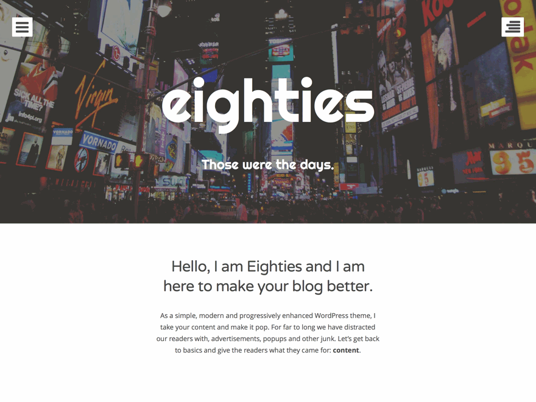

# Hello, my name is Eighties

I am a modern, progressively enhanced theme designed to keep your content front and center. My menu and sidebar are built to stay out of the way until a user wants to see them. When clicked, users get a nice clean overlay.

As a simple, modern and progressively enhanced WordPress theme, I take your content and make it pop. For far to long we have distracted our readers with, advertisements, popups and other junk. Let’s get back to basics and give the readers what they came for: __content__.

You can learn more about me on [the site that my maker built](http://eighties.me). I assure you that both you and your site's visitors will love me; also, you can expect updates and future enhancements for years to come (because my maker loves me, too).

## Installation

Well, this depends on you, as there a many ways to get a theme working on your WordPress site.

### WordPress.org (Recommended)

If you have a self hosted WordPress site, then I would recommend downloading me from the WordPress.org repo on your site's theme admin page. You can do that like so.

1. In your admin panel, go to Appearance > Themes and click the __Add New__ button.
2. Search for Eighties, once your find the theme click __Install__
3. Click __Activate__ to use your new theme right away.
4. There is no step four.

### WordPress.com

__NOTE__: Currently waiting on approval from WordPress.com. Sorry, there is nothing you can do to help this. Perhaps you should [send them a tweet](https://twitter.com/wordpressdotcom).

If your site is on WordPress.com, then I honestly don't know why you would be viewing this project on Github (unless you want to contribute). You should go to your site and shout out my name! Oh, and by 'shout out', I mean 'search for'.

Or you could follow these steps.

1. In your admin panel, go to Appearance > Themes and click the __Add New__ button.
2. Search for Eighties, once your find the theme click __Install__
3. Click __Activate__ to use your new theme right away.
4. There is no step four.

### Direct Upload

Ohhh, you must be a real go-getter. You can download the latest release from Github, then follow these steps and I'll be active in no time.

1. In your admin panel, go to Appearance > Themes and click the Add New button.
2. Click Upload and Choose File, then select the theme's .zip file. Click __Install Now__.
3. Click Activate to use your new theme right away.
4. There is no step four.

## FAQs

You can view the [full FAQ here](http://eighties.me/faq/).

## License

If I could get a tattoo, it would say [GPL](http://www.gnu.org/licenses/gpl-2.0.html).

## Contribute

Hey, nobody's perfect. If you see something wrong with me, or simply want to make me better, do not hesitate to submit an issue or pull request.